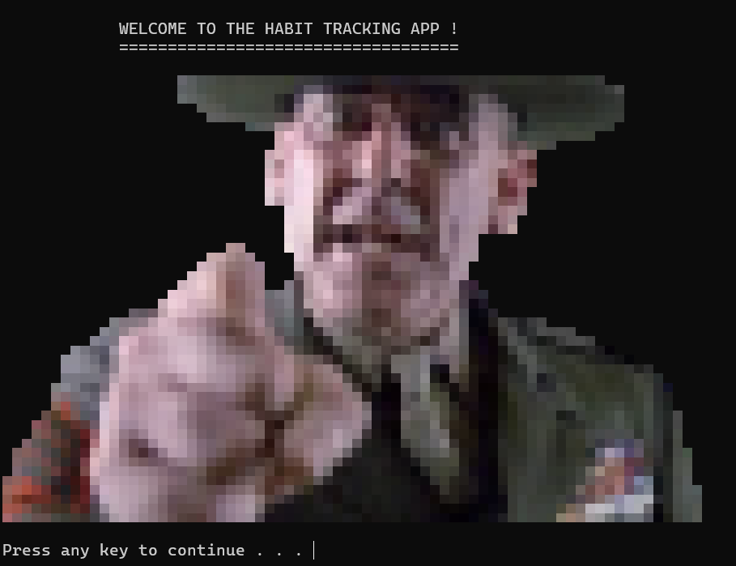
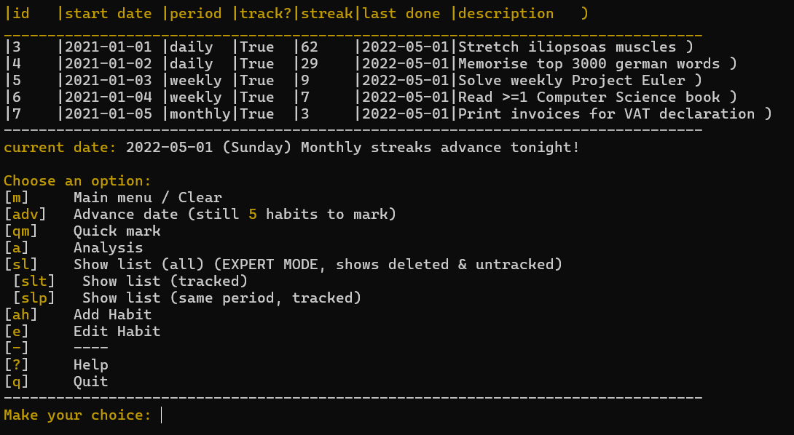
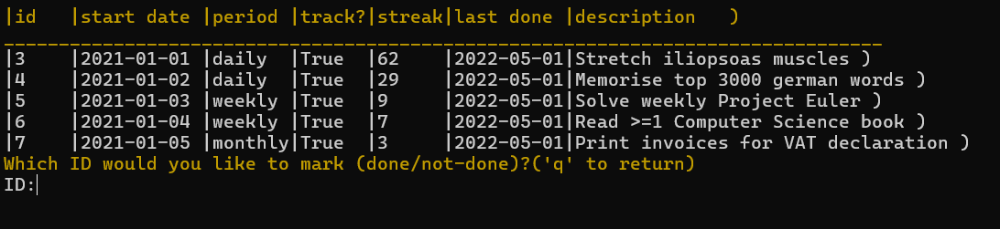
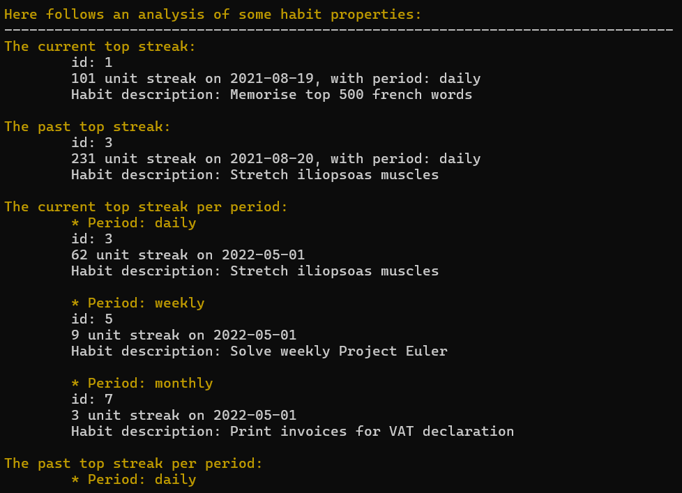

# Habit Tracker project for IUBH

## Table of Contents

### 1. Screenshots
### 2. Installing
#### 2.a) Dependencies
#### 2.b) Option 1: clone and run
#### 2.c) Option 2: download packaged binaries
#### 2.d) Option 3: (unstable) install from 'pyproject.toml'
### 3. Using the software

---

## 1. Screenshots
Startup


Tabular overview of tracked habits


Marking habits (done / not-done)


Analysis of some habits


## 2. Installing

### 2.a) Dependencies
For the program itself there are no dependencies, other than the Python Standard Library

For testing, Pytest is used (>= 8.3.3).

Python >= 3.13.0 is required, as the new syntax regarding type hints is used.

### 2.b) Option 1: clone and run
1) Make sure you have a Python version >= 3.13.0
   
e.g. if using Pyenv for version management:
 ```
pyenv install 3.13.3
```
e.g. with 'uv':
```
uv python install 3.13
```

2) Clone the project


 ```
git clone https://github.com/rzhlm/IUBH-habittracker.git
cd IUBH-habittracker
 ```
**3a) if you don't want to run any testing, then you don't need to install anything further.**

simply run it:
```
python main.py
```
**3b) if you would like to run the testing, you need to install PyTest**

it is recommended to make a virtual environment.

e.g. with Python directly:
```
python -m venv venv --prompt HabitTracker
.\venv\Scripts\activate.bat (on Windows)
source /venv/bin/activate (POSIX)
```
or with the equivalent options in e.g. 'uv' or 'pyenv', or whichever tools you use.
Once that is done, you can install the required PyTest package:
```
uv pip install -r requirements.txt
or 
pip install -r requirements.txt
or
pip install pytest
```

and then you can run the tests, e.g.
```
pytest .
or
pytest -v .
```


### 2.c) Option 2: Download a packaged binary release
This has only been tested on local development machines: 

Even though they are packaged for standalone use, it could be that particular dependencies are needed on your device.

Windows (x64): [here](https://github.com/rzhlm/IUBH-habittracker/releases/download/v1.0.0/habits-win-x64.exe) (packaged with pyinstaller)

macOS (Apple ARM): [here](https://github.com/rzhlm/IUBH-habittracker/releases/download/v1.0.0/habits-macos-arm-nuitka.bin) (compiles with Nuitka)


### 2.d) Option 3: (experimental) install from 'pyproject.toml'

This is not a recommended method, it is experimental at the moment.
You are free to try, if you'd like.


Clone from GitHub, as described above.

Then install:

e.g. with 'uv': 
```
uv pip install .[test]
```
e.g. with 'pip': 
```
pip install .[test]
```

and then run:
```
 python main.py
```

## 3.Using the software

Also see the help-section at startup, and in the menu.


        
The colored letters are commands, which you should input.

A habit can be tracked or untracked.
(untracked: is for 'archival'/'soft deletion').
(A deleted habit is flagged with 'streak = -1', and can only be
seen in the special 'show-list (all) EXPERT' command.)

The date has to be advanced manually (this is a great feature).
It does not use your system date. This forces you to be pro-active.
You're not able to advance the date, until each tracked habit has
been marked "done" or "not done", for the day.
Do this with "Quick mark".

- The Daily streaks increments are visible *after* advancing to the next day.

- The Weekly streaks increments are visible *after* advancing from Sunday to Monday.
(i.e. the evaluation theoretically happens on midnight at Sunday)

- The Monthly streak increments are visible *after* advancing from last day of 
a month to first of the next month.
(i.e. the evaluation theoretically happens on midnight on the last day)

When you edit, you can change: track/untrack, description, or delete.

EXPERT MODE: for easy evaluation. Streak of -1 is used
to flag a deleted habit.


---

