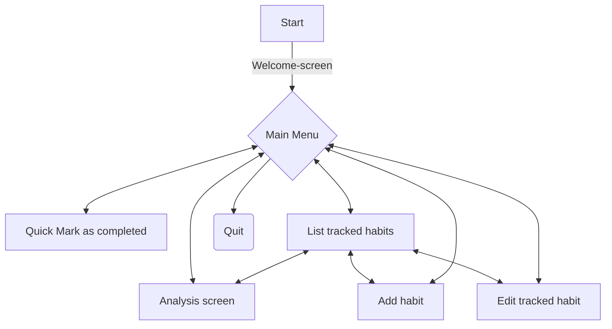

- [x] Give list of all tracked habits
- [x] Give list of all habits with same period
- [x] Return longest streak of all habits
- [x] Return longest streak for chosen habits

- [ ] MAKE TESTS FOR FUNCS & METHODS

- [ ]  Habit has action & period
-  [ ] An action/task can be checked off
-  [ ] Miss = break
-  [ ] streak
-  [ ] Analysis of best & worst

-  [x] At least Weekly & Daily periods
-  [ ] min 5 preloaded (w & d) habits, with min 4 weeks of data
-  [ ] creation date + date/time of task completion

- [ ] add notice to best use winterminal, not console; nor default Mac terminal

# UI flow
